# 介绍

> 我对普通的人类没有兴趣，你们只要是有外星人、未来人、异世界人、超能力者， 就尽管来找我吧！以上！

这是一个针对于前端编译的服务，涉及到相关技术分别有 [jenkins](https://jenkins.io/)，[docker](https://www.docker.com/)，[rabbitMQ](https://www.rabbitmq.com/) 等。主要是 [mis](http://mis.x.com/) 与 [JDBuild](http://wiki.jdb-dev.com/pages/viewpage.action?pageId=49190604) 的整合，并作为一套服务对外开放，具体可见[开发背景](background.md)

## 模式

Hawthorn 提供两种模式，分别是 **一般模式** 和 **RPC模式**

### 一般模式

### RPC模式

## 特点

- 扩展
- 多样
- 稳定
